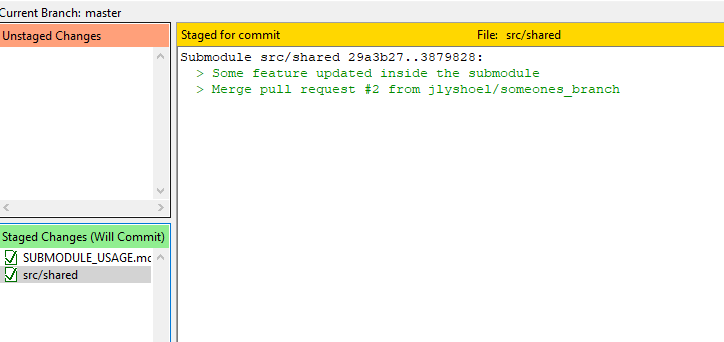

# How to setup your project with a git submodule


When configuring your new app / repo, you can select one directory (does't have to be on root level) that you want to configure to get content from a submodule. 

For this guide, we'll use /src/shared


## 1. Configure

On the command line: 
```
cd src
git submodule add https://github.com/jlyshoel/react-example-submodule shared
```

## 2. How to relate main repo with submodule

When doing a branch, fetch/pull inside the submodule, you'll be asked to make a commit to your main repo. 



## 3. Working with content in submodules

Checking out branches, commit, pull/push are mostly the same as it is for normal git, with exception that you have to be in the submodule directory.


**Checkout new branch:**
```
cd src/shared
git checkout -b my_branch
```

**Checkout existing branch**
```
cd src/shared
git fetch
git checkout someones_branch
```

**Commit**

Example for committing all changes

```
cd src/shared
git add .
git commit
```


**Push**

```
cd src/shared
git push
```

**Pull**

```
cd src/shared
git pull
```


## 3. Running example app

awdwad
